# 💼 BizSplit

<p align="center">
  
</p>

<h3 align="center">
Smart Inventory, Sales, Expense & Profit Management for Small Businesses
</h3>

<p align="center">
A modern Flutter application that helps small business owners manage inventory, track sales and expenses, monitor profits, receive low-stock alerts, and automatically allocate earnings between Business, Savings, and Personal Use.
</p>

<p align="center">


</p>

---

# 📖 Overview

Managing a small business shouldn't require complicated accounting software.

BizSplit is designed for entrepreneurs who want a simple but powerful solution for tracking inventory, recording sales, monitoring expenses, analyzing business performance, and managing profits.

Whether you own a phone accessories shop, clothing business, retail store, market stall, or side hustle, BizSplit provides everything needed to stay organized and make informed financial decisions.

---

# ✨ Features

## 🔐 Authentication

Secure account management powered by Firebase Authentication.

- Create an account
- Secure Login
- Forgot Password
- Cloud-based user authentication

---

## 📊 Dashboard

### Overview

Monitor your business from one place.

- Today's Revenue
- Today's Profit
- Business Allocation
- Savings Allocation
- Personal Allocation
- Lifetime Revenue
- Lifetime Profit
- Inventory Summary
- Low Stock Indicators

### Analytics

Gain insights into business performance.

- Revenue Trends
- Profit Trends
- Monthly Comparisons
- Profit Allocation Charts
- Top Selling Products

---

## 📦 Inventory Management

Manage products with ease.

- Add Products
- Edit Products
- Delete Products
- Cost Price
- Selling Price
- Product Quantity
- Automatic Stock Updates

---

## 💰 Sales Tracking

Record transactions quickly.

- Product Selection
- Revenue Calculation
- Profit Calculation
- Sales History
- Automatic Inventory Deduction

---

## 💸 Expense Tracker

Track every business expense.

- Record Expenses
- Expense Categories
- Daily Spending
- Expense History
- Profit Impact Analysis

---

## 🔔 Low Stock Notifications

Stay informed before inventory runs out.

- Automatic Alerts
- Dashboard Notifications
- Custom Low Stock Threshold
- Restock Reminders

---

## ⚙️ Settings

Customize BizSplit to suit your business.

### Currency

Supports multiple currencies.

- GH₵
- $
- ₦
- £
- €
- and more...

### Profit Split

Automatically divide profits into:

- Business
- Savings
- Personal Use

using customizable percentages.

### Low Stock Threshold

Set the minimum stock quantity before notifications appear.

### Reports

Generate reports for:

- Sales
- Profits
- Expenses
- Inventory

### Security

- Change PIN
- Sign Out

---

# ⚡ How BizSplit Works

Whenever a sale is recorded:

1. Revenue is calculated automatically.
2. Profit is calculated from the product's cost price.
3. Profit is divided according to the configured Business, Savings, and Personal percentages.
4. Inventory updates instantly.
5. Dashboard analytics refresh automatically.
6. Low stock alerts appear when product quantities reach the configured threshold.

This helps business owners separate business finances from personal spending while maintaining accurate inventory records.

---

# 📱 Application Walkthrough

## 🚀 Splash Screen

The application's launch screen displayed while BizSplit initializes.


---

## 💼 Welcome Screen

Displays the BizSplit branding before entering the application.

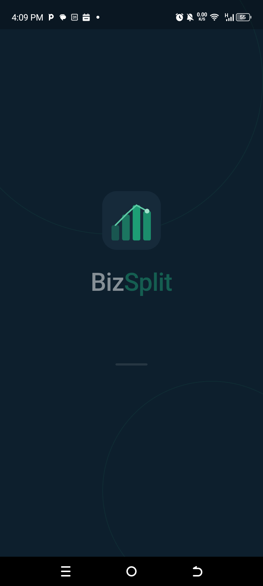

---

## 📝 Sign Up

Create a new account to securely manage business data.

Quick links include:

- Login
- Forgot Password

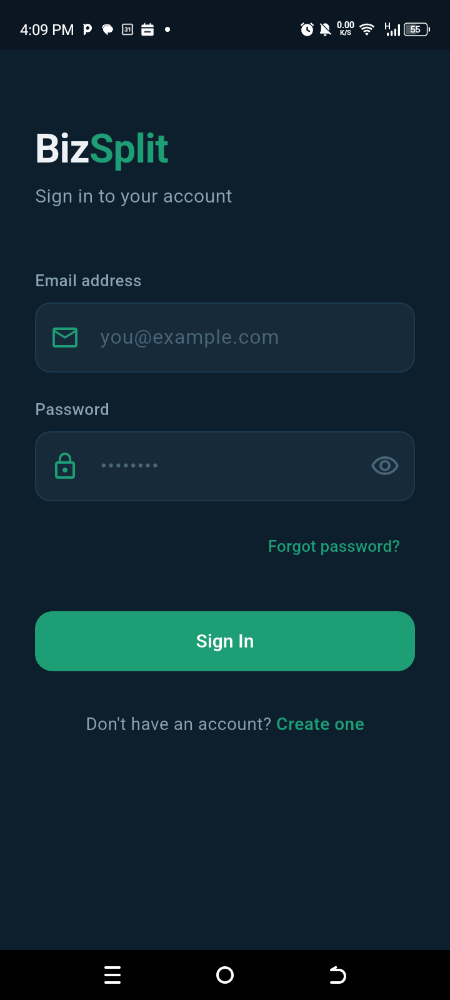

---

## 🔐 Login

Securely access your business dashboard.

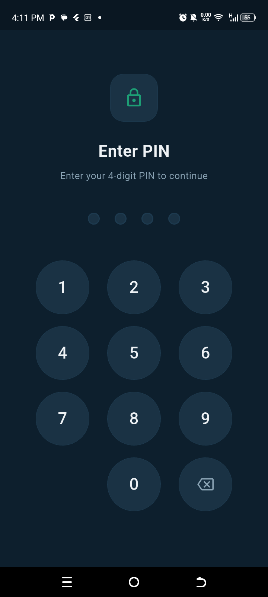

---

## 📊 Dashboard — Overview

Provides a complete summary of business performance.

- Revenue
- Profit
- Allocations
- Inventory
- Business Health

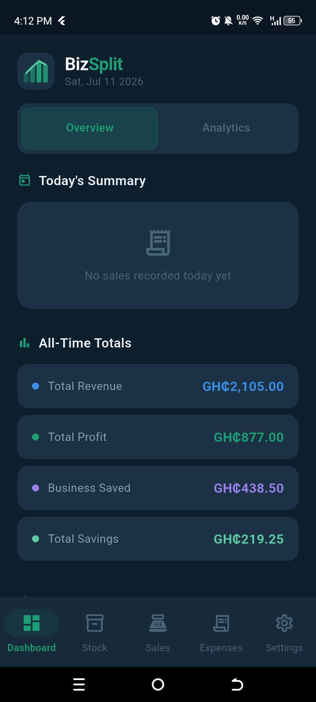

---

## 📈 Dashboard — Analytics

Visualize business performance with charts and reports.

- Revenue Trends
- Profit Analysis
- Monthly Comparison
- Top Products

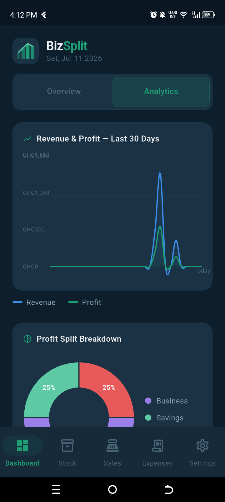

---

## 📦 Stock Management

Manage products and inventory.

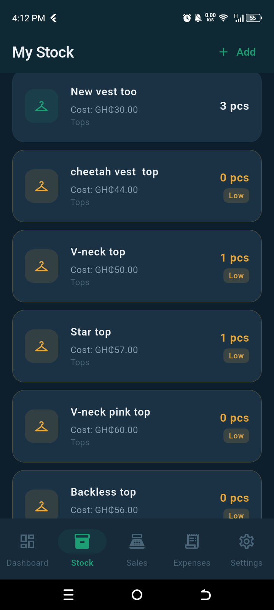

---

## 💰 Sales Tracking

Record sales with automatic revenue and profit calculations.

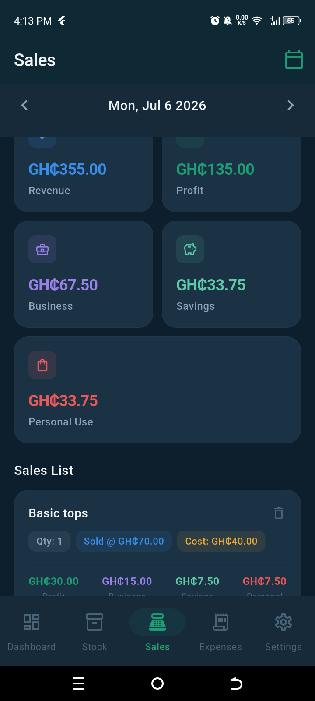

---

## 💸 Expense Tracker

Track daily business expenses and monitor spending.

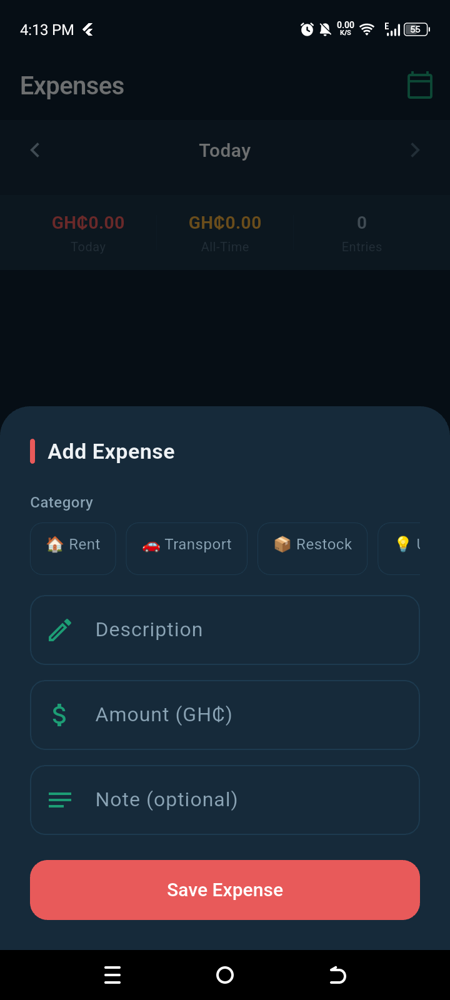

---

## 🔔 Low Stock Notification

Automatic alerts notify users whenever inventory falls below the configured threshold.


---

# ⚙️ Settings

## Main Settings

Access every business preference from one central location.

Available options include:

- Currency
- Profit Split
- Low Stock Number
- Reports
- Change PIN
- Sign Out

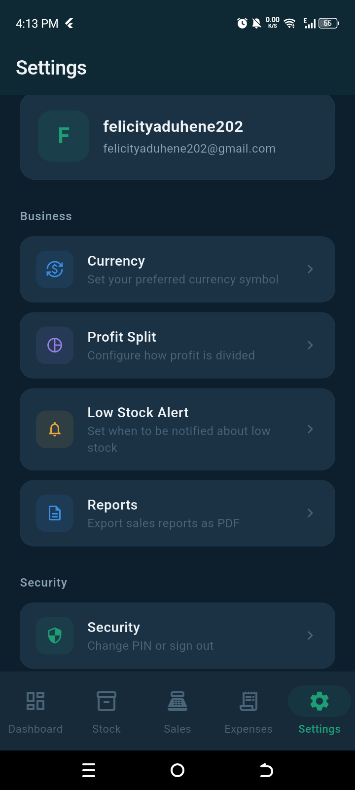

---

## 💱 Currency Settings

Choose your preferred business currency.

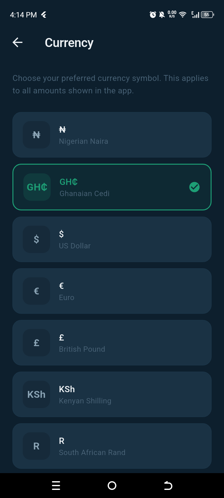

---

## 📊 Profit Split

Configure automatic allocation percentages.

- Business
- Savings
- Personal Use

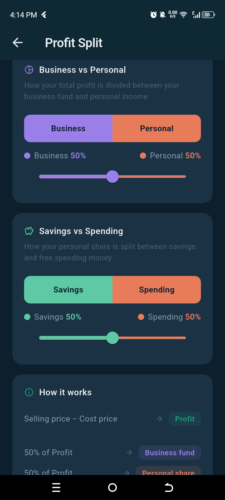

---

## 📦 Low Stock Number

Set the minimum quantity that triggers stock notifications.

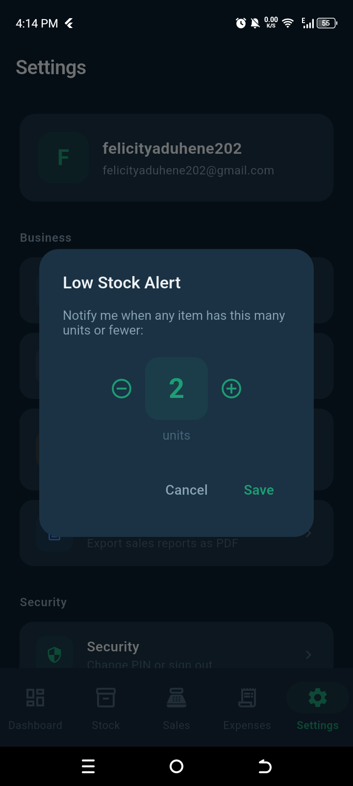

---

## 📄 Reports

Generate business reports for better decision making.

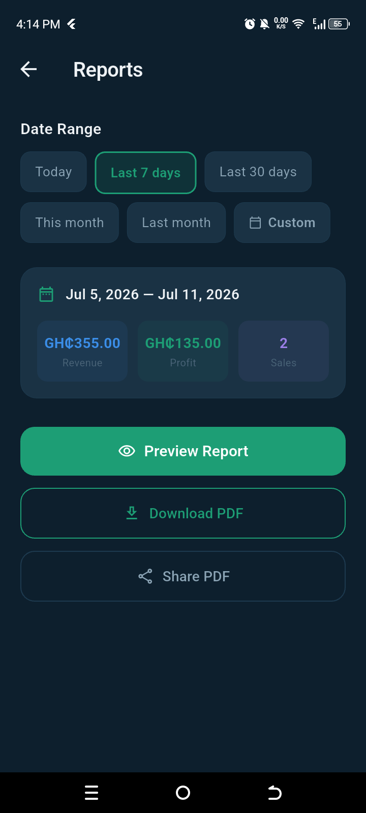

---

## 🔒 Security

Manage account security.

- Change PIN
- Sign Out

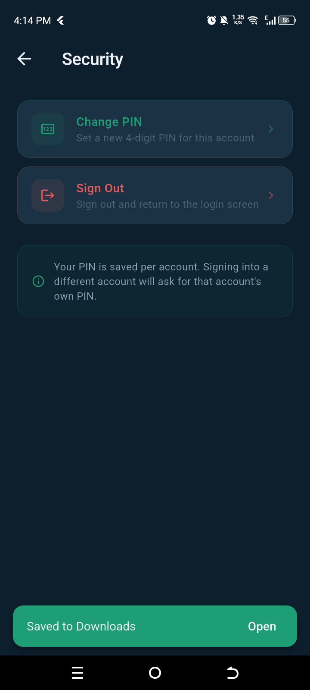

---

# 🎯 Target Users

BizSplit is designed for:

- 📱 Phone Accessory Sellers
- 👕 Clothing Businesses
- 🛍 Retail Stores
- 🏪 Market Traders
- 🎓 Student Entrepreneurs
- 💼 Small Business Owners
- 🛒 Independent Merchants

---

# 🚀 Future Enhancements

Planned improvements include:

- Barcode Scanner
- Customer Management
- Supplier Management
- Invoice Generation
- PDF Reports
- Excel Export
- AI Business Insights
- Multi-device Synchronization
- Dark Mode
- Multi-language Support

---

# 🛠 Tech Stack

- Flutter
- Dart
- Firebase Authentication
- Cloud Firestore
- SQLite
- SharedPreferences
- Material Design 3

---

# 📥 Installation

Clone the repository.

```bash
git clone https://github.com/Boat-ui/Sales-Tracker-App
```

Navigate to the project.

```bash
cd BizSplit
```

Install dependencies.

```bash
flutter pub get
```

Run the application.

```bash
flutter run
```

---

# 👨‍💻 Author

**Enock Boateng**

Flutter Developer • Front-End Developer • Cybersecurity Enthusiast

GitHub

https://github.com/Boat-ui

Portfolio

<https://boat-ui.github.io/personal-portfolio/>

---

# 📄 License

This project is licensed under the MIT License.

---

## ⭐ Support

If you found this project useful, consider giving it a ⭐ on GitHub. Your support helps the project reach more developers and motivates future improvements.